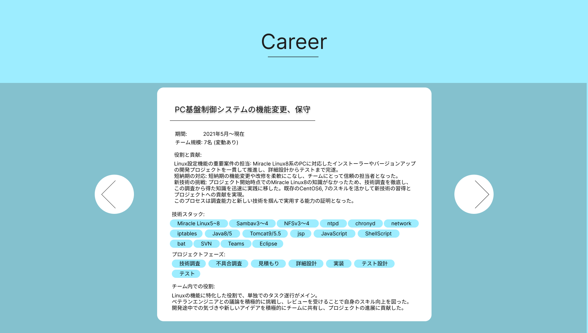
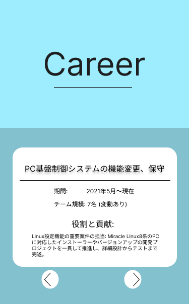
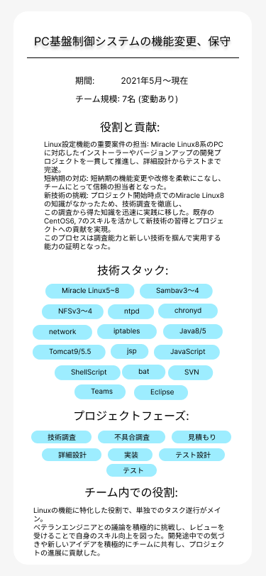

# career(コンポーネント設計)

---

### [画面サンプル]

### [必要なデータ]

- タイトル
- 案件タイトル
- 期間タイトル
- メンバータイトル
- コンテンツタイトル
- 技術スタックタイトル
- フェーズタイトル
- 役割タイトル

- キャリアデータ(リスト)
  - 案件名
  - 開始日
  - 終了日
  - メンバー人数
  - コンテンツ
  - 技術スタック(リスト)
    - 技術スタック
  - 案件フェーズ(リスト)
    - 案件フェーズ
  - 役割

### [小コンポーネント]
- カード(PC、タブレット)
  何もしない
- カード(スマホ)
  詳細カード表示
- ナビゲーション、ページネーション
  カードのスライド
- 詳細カード
  詳細カードを閉じる

### [タブレット版の場合]

### [スマホ版の場合]

### [スマホ版でカードをタップした場合]

