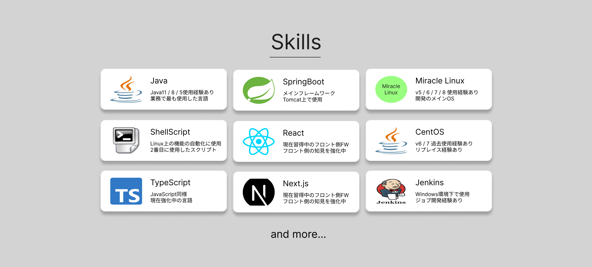
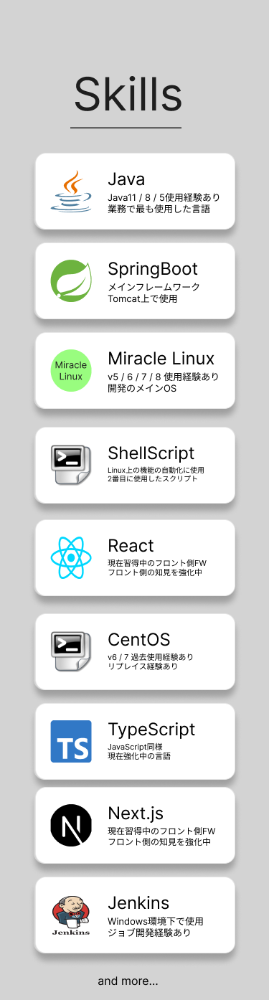

# skills(コンポーネント設計)

---

### [画面サンプル]

### [必要なデータ]

- タイトル
- and more名
- スキルリスト
  - スキルアイコン
  - スキルタイトル
  - スキルコンテンツ 

### [小コンポーネント]
- カード
  初期表示の数は9
- and more
  押下時に非表示分を読み込み追加表示する

### [タブレット版の場合]

### [スマホ版の場合]

