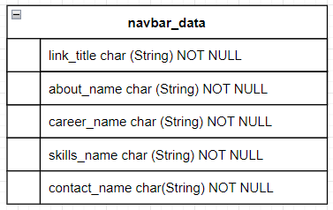
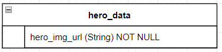
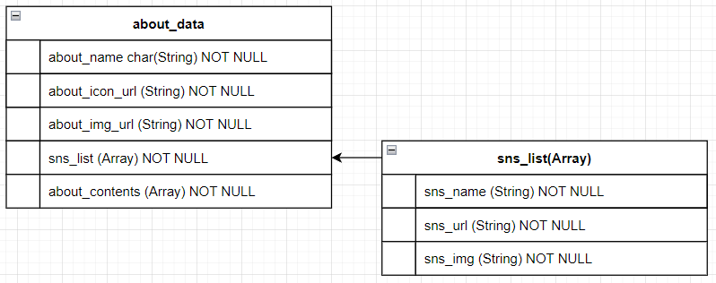
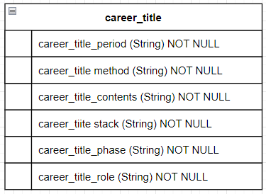
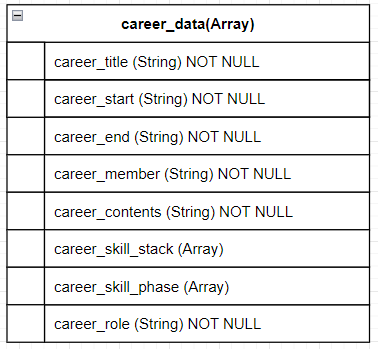
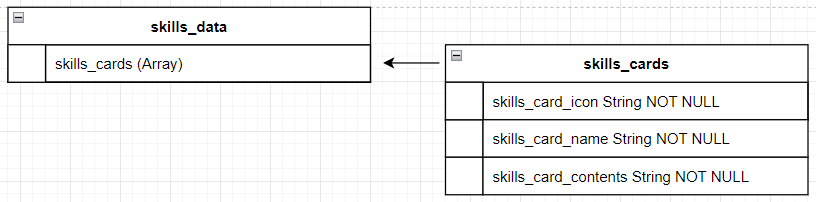
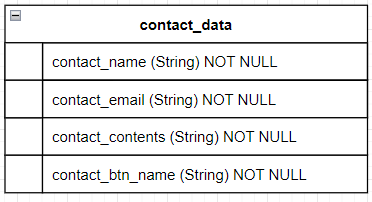
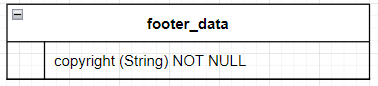

# navbar(データ設計)

---

### [データサンプル]

#### [navbar_data]

#### [hero_data]

#### [about_data]

#### [career_title_data]

#### [career_data]

#### [skills_data]

#### [contact_data]

#### [footer_data]

